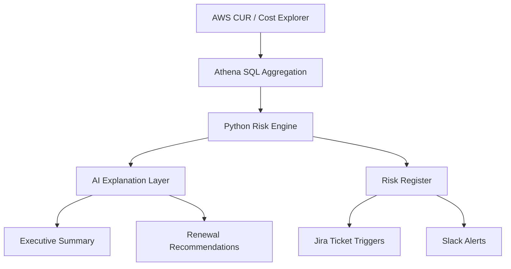

# AI-Powered Commitment Governance Engine
> Turning cloud commitment data into governed financial decisions.
**Detect. Explain. Recommend. Govern.**
> Turning cloud commitment data into governed financial decisions.

A FinOps automation prototype that analyzes AWS Savings Plans, Reserved Instances, and cloud credits to detect financial risk, explain cost exposure, and recommend renewal actions.

---

## 🚀 Overview

Cloud commitment strategies often begin as optimization decisions—but over time, they become **governance challenges**.

Savings Plans, Reserved Instances, and credits can drift out of alignment with real workload behavior, creating:

* unexpected cost spikes when commitments expire
* underutilized commitments that waste spend
* increasing on-demand leakage
* hidden cost exposure after credits expire
* reactive, last-minute renewal decisions

This project transforms commitment management into a **structured FinOps operating system**.

---

## 🎯 The Goal

Turn cloud commitment data into:

* **actionable insights**
* **financial risk visibility**
* **clear renewal decisions**
* **accountable workflows**

Not just reporting.

**Operational governance.**

---

## 🧠 What This Engine Does

This engine:

* builds a centralized commitment inventory
* tracks expiration timelines and renewal windows
* evaluates utilization and effective savings
* detects underutilization and coverage gaps
* identifies credit expiration (“credit cliff”) risks
* generates AI-powered executive summaries
* recommends renew / resize / replace / let-expire decisions
* prepares structured outputs for Jira workflows and Slack alerts

---

## 🏗️ Architecture



---

## 🔍 How It Works

### 1. Data Layer

* AWS Cost and Usage Report (CUR) / Cost Explorer
* Queried and aggregated using Athena

### 2. Decision Layer (Python)

* Calculates:

  * utilization %
  * coverage %
  * effective savings
* Applies FinOps rules to detect risks

### 3. AI Layer

* Converts structured signals into:

  * executive summaries
  * engineering explanations
  * renewal recommendations

### 4. Action Layer

* Outputs:

  * risk register
  * summary reports
  * Jira-ready actions
  * Slack alerts

---

## ⚠️ Risk Types Detected

* **Expiration Risk**
  Commitments expiring soon → potential cost spike

* **Underutilization Risk**
  Commitment no longer aligned with workload

* **Coverage Gap Risk**
  Excess on-demand usage despite commitments

* **Credit Cliff Risk**
  Credits masking true cost → upcoming increase

* **Architecture Drift Risk**
  Workload pattern no longer matches commitment type

---

## 📊 Sample Outputs

The engine generates:

### `inventory.csv`

Full commitment inventory with utilization, ownership, and timing

### `risks.csv`

Structured risk register with severity and financial exposure

### `summary.md`

AI-generated executive summary

### `actions.json`

Machine-readable action queue for automation

---

## 🧾 Example Executive Summary

> Three material commitment risks identified this cycle.
> One EC2 Savings Plan expires in 42 days and remains highly utilized, making renewal likely favorable.
> One RDS reservation shows persistent underutilization following workload reduction, suggesting non-renewal or resizing.
> Estimated potential monthly exposure if unaddressed: $18,500.

---

## 💡 Example Recommendation

> Review renewal of the expiring EC2 commitment within the next 30 days.
> Current utilization remains high, but workload distribution has shifted toward more flexible usage patterns.
> A Compute Savings Plan may provide better long-term alignment than renewing a rigid reservation structure.

---

## 📁 Repository Structure

```
ai-powered-commitment-governance-engine/
├── README.md
├── requirements.txt
├── sql/
│   └── commitment_inventory.sql
├── src/
│   ├── main.py
│   ├── risk_rules.py
│   ├── ai_summary.py
│   ├── recommend.py
│   ├── slack_notifier.py
│   └── jira_writer.py
├── data/
│   └── sample_commitment_data.csv
├── outputs/
│   ├── inventory.csv
│   ├── risks.csv
│   ├── summary.md
│   └── actions.json
├── docs/
│   ├── sample-risk-report.md
│   ├── sample-renewal-recommendations.md
│   └── use-cases.md
└── images/
    └── architecture.png
```

---

## 🧪 Use Cases

### 1. Commitment Renewal Governance

Detect expiring Savings Plans and trigger proactive renewal decisions

### 2. Underutilization Detection

Identify commitments no longer aligned with workload behavior

### 3. Coverage Optimization

Highlight on-demand leakage and recommend improved commitment strategy

### 4. Credit Expiration Planning

Forecast post-credit spend and prevent surprise cost increases

---

## ⚙️ How to Run (MVP)

```bash
pip install -r requirements.txt
python src/main.py
```

Outputs will be generated in the `/outputs` directory.

---

## 🔧 Tech Stack

* AWS CUR / Cost Explorer
* Amazon Athena
* Python (pandas, boto3)
* AI Layer (LLM-based summarization)
* Optional integrations:

  * Jira API
  * Slack Webhooks

---

## 🧭 FinOps Perspective

This project treats cloud commitments as:

> **financial instruments requiring lifecycle governance**

It applies a structured model:

* **Visibility** → what do we own?
* **Performance** → is it being used efficiently?
* **Risk** → what could go wrong soon?
* **Action** → who needs to decide and when?
* **Communication** → how do we explain exposure clearly?

---

## 🏁 Portfolio Positioning

This project demonstrates how FinOps can move beyond reporting into **operational governance**.

It shows how cloud cost signals can be:

* detected automatically
* translated into financial impact
* explained in plain language
* routed into structured action

It reflects a **systems-thinking approach** to cloud financial management—combining:

* cloud economics
* data engineering
* automation
* decision support

---

## 📌 Highlights

* Detects renewal, utilization, and coverage risks
* Converts billing signals into actionable decisions
* Uses Athena + Python + AI explanation layer
* Produces executive-ready summaries
* Designed for Jira- and Slack-integrated workflows

---

## 🔮 Future Enhancements

* Real-time Athena query integration via boto3
* Automated Jira ticket creation
* Slack alerting for high-severity risks
* Forecasting engine for commitment planning
* Scenario simulation (renew vs replace vs expire)

---

## 👩🏽‍💻 Author

Built as part of a FinOps systems-thinking approach to cloud cost governance.

---

## ⭐ Tagline

**Detect. Explain. Recommend. Govern.**
